# <span style="color:yellow">🚀 Task 1 🚀</span>


## <span style="color:darkorange">Subtask 1</span>

8 / 10 punktów (źle odpowiedziałam na pytanie o testy eksploratacyjne oraz typy testów 🫤 ). 

## <span style="color:darkorange">Subtask 3</span>

Cześć 🙂 Mam na imię Dorota. Biorę udział w projekcie, ponieważ jestem przekonana, że trzeba wykorzystywać każdą szansę na rozwój nowych umiejętności. Mam także nadzieję, że w niedalekiej przyszłości będę mogła użyć wiedzy wyniesionej z challengu, przy prawdziwym, "żywym" projekcie. 

Póki co pierwsza lekcja za mną - nauczyłam się czym jest i jak używać Markdown 🤟 oraz udało mi się naprawić wyświetlanie litery "ż" w VScode ( my nemesis 😵‍💫 😃). W prawdzie nie są to niebywałe osiągnięcia 😜, ale jak to mówi stare, chińskie przysłowie ( i w tym wypadku to **```NAPRAWDĘ JEST STARE, CHIŃSKIE PRZYSŁOWIE!```** 😅):
>*"A journey of a thousand miles begins with a single step"* 🫶  

##### *(autora nie znam, ale najpradopodobniej jest nim chiński Paulo Coelho :D )*


Dorka

## <span style="color:darkorange">Subtask 4</span>
<span style="color:limegreen">**1. Na czym polega ta aplikacja? Do czego służy?**</span>

*Aplikacja Scouts Panel służy to wyszukiwania przez scoutów ( być może również trenerów) potencjalnych talentów piłkarskich, spośród zawodników , których profil widnieje w zakładce GRACZE. Nie jest dla mnie do końca jasne, czy profil gracza zakładają sami "łowcy talentów" i to oni monitorują, oceniają oraz zapisują poczynania i postępy danego zawodnika (zakładka RAPORT), czy może taki profil może stworzyć każdy gracz ( co byłoby jednak nieobiektywne) bądź trener danego zawodnika.*


**<span style="color:limegreen">2. Jakie funkcjonalności znajdują się w aplikacji? Do czego służą. Czy są intuicyjne, czy może byś coś zmienił_a? (Nie bój się wyrażać opinię!)**</span>

STRONA GŁÓWNA:

*   wejście w link "Dodaj gracza" przenosi nas na stronę formularza, który uzupełniamy danymi gracza, zakładając w ten sposób jego "profil" (?); 
    
    * W celu poprawienia funkcjonalności formularza dodałabym tam pewne ograniczenia, jeśli chodzi o używanie znaków oraz ich ilości. Większośc kategorii jak np. wiek, waga, wzrost, główna pozycja miałyby pewne opcje do wyboru. W ten sposób uzupełnienie formularza byłoby sprawniejsze i wykluczałoby w jakimś stopniu błędy związane z nieprawidłowym wpisaniem poszczególnych danych ( jak chcociażby waga zawodnika jako wartość ujemna);


*   wejście w poszczególne linki w kolumnie "Aktywnosć"(z literówką, by the way) przekierowują nas odpowiednio na wybraną zakładkę 

    * Np. link pod tytułem "Ostatnio stworzony gracz" przekierwouje nas na "profi" tegoż zawodnika - a przynajmniej tak jest według opisu. Jednak ponieważ przy imieniu zawodnika nie widnieje żaden numer, który mógłby wskazywać, że jest to na pewno ostatnio dodany zawodnik, nie mamy tej pewności, dlatego dodałabym tu "numer ewidencyjny"; 


*   po wejściu w link Dev Team Contact, otwiera sie strona Slack, na której można zalogować się do konkretnego workspace. 
*   po wejściu w zakładkę Gracze, na stornie wyświetla się 8-mio kolumnowa tabela z podstawowymi danymi graczy.Po najechaniu kursorem na wybrany wiersz, background zmienia delikatnie kolor na ciemniejszy, natomiast cursor, w zależności od miejsca w którym nim najedziemy, jest albo strzałką albo kursorem textu (jeśli wskażemy na text). Wg mnie powinno być to spójne, ponieważ taki podział jest mylący (nie wiadomo, czy możemy kliknąć w ten wiersz czy nie);
*   możliwość zmiany języka z polskiego na angielski i odwrotnie;
*   przycisk "Wyloguj", który po naciśnięciu wylogowuje nas z aplikacji i przekierowuje nas na strone logowania; 

(P.S. Z braku czasu /deadline goni 🥵/ na ten moment muszę na tym zakończyć analizowani funkcjonaności strony, ale mam nadzieję jeszcze do tego wrócić 🫡)

**<span style="color:limegreen">3. Oceń interfejs aplikacji (wygląd) – czy Ci się podoba, czy nie?**</span>

*Intrfejs aplikacji w mojej opinii jest dosyć ubogi i nie zachęca do korzystania z niej. Słaba i niespójna kolorystyka(np. kolorowe paski po lewej stornie pól ILOŚĆ GRACZY/MECZY/RAPORTÓW/AKCJI, które kompletnie ni jak się mają do niebieskieho header'u), brak animacji czy ikon(śladowe ilości). Grafika przedstawiająca logo jest niewyraźna (nie zostało dodana wersja pod Retinę ) Również sam jej layout budzi we mnie uczucie jakiegoś "bałaganu" (np. pola "Scout Panel", "Linki pomocnicze" oraz "Aktywność" na mobile nie są ładnie wyśrodkowane, więc w mojej głowie od razu rodzi się pytanie DLACZEGO TAK JEST?). Look&Feel w skali 1-10, mocne 2* ( oczywiście takie mądre, amełykańskie nazewnictwo oraz jego znaczenie w projektowaniu m.in. aplikacji znam z artykułu https://thestory.is/pl/journal/look-and-feel/ 🤓). 


**<span style="color:limegreen">4. Czy aplikacja jest intuicyjna? (Intuicyjna, czyli np. nie masz problemu ze zrozumieniem, co należy kliknąć, żeby wejść do formularza dodawania nowego zawodnika piłki nożnej do systemu).**</span>

*Mimo nieprzyjaznego interfejsu aplikacja wydaje mi się całkiem intuicyjna. Nie wiem jednak, czy jest to kwestia tego,że przeklikałam ją z 500 razy* 🤯 *i już wiem, gdzie czego szukać, czy może jednak faktycznie nie najtrudniej się w niej odnaleźć. Spełnia swoją funkcję, jaką jest stworzenie profilu Gracza oraz Raportu z jego poczynań w danym meczu. Oprócz podstawowych danych Gracza, można również dokonać opisowej oceny zawodnika(podczas tworzenia Raportu).* 

**<span style="color:limegreen">5. Czy zauważasz jakieś błędy? Albo coś wydaje Ci się błędem? Zapisz swoje przemyślenia w pliku. Tutaj masz na to miejsce, czas i przestrzeń! ;)**</span>

*Poniżej znajduje się lista rzeczy, które w mojej ocenie są błędami aplikacji:*

*   *Po wejsciu w konsole, w zakładce PROBLEMS wyświetla się następujący komunikat:*
>A page or script is accessing at least one of navigator.userAgent, navigator.appVersion, and navigator.platform. Starting in Chrome 101, the amount of information available in the User Agent string will be reduced.

*z informacji które odnalazłam m.in. na* https://stackoverflow.com/questions/68924463/a-page-or-script-is-accessing-at-least-one-of-navigator-useragent-navigator-app *oraz*  https://github.com/adobe/react-spectrum/issues/2189, *wynika, iż aplikacja używa starych zasobów tj: __navigator.userAgent__, __navigator.appVersion__,
__navigator.platform__. Wszelkie linie kodu, które w jakikolwiek sposób się do nich odnoszą, po aktualizaji nie będą dostępne. W związku z tym, trzeba będzie dostosować JavaScript tak, aby te dane były jednak dostępne nawet po zmianie;*


*   *W zakładce AKTYWNOŚĆ button'y z linkami są różnie rozmieszczone - część z nich jest wyrównana do lewej, część otrzymała "dziwny" margin; myślę, że nie jest to zamierzony afekt, a błąd deklaracji w jednej z class ( dotyczący justify-content bądź min-width);*
*   *Raport Lighthouse:*

       * WYDAJNOŚĆ: raport wskazuje na dosyć niską wydajność aplikacji (51%). W zaleceniach dotyczących poprawy wydajności pojawia się komunikat o skróceniu czasu wykonywania JavaScriptu. 
       
       * NAWIGACJA: elementy nagłówków pojawiają się w nieprawidłowej kolejności. Z informacji, które znalazłam m.in. tu https://www.widzialni.pl/blog/naglowki-h1-h2-h3-pozycjonowaniu-jaki-maja-wplyw-na-seo/wynika, iż hierarchia nagłówków ma znaczenie i "wpływa na lepsze zrozumienie treści przez roboty, (...) na funkcje użytkowe i SEO-we".

       * ZAUFANIE I BEZPIECZEŃSTWO: wykryto 3 luki w zabezpieczeniach w bibliotece Next.js@10.0.0 . 

*   *Aplikacja nie jest w pełni reponsywna - na mobile oraz tablet, po wejsciu w zakładki DODAJ MECZE oraz RAPORTY, na dole ekranu pojawia się poziomy pasek przewijania.*

*   *Tabela GRACZE podczas korzystania z aplikacji na mobile, została podzielona na pewnego rodzaju karty każdego dodanego Gracza, zawierające jego podstawowe dane. Sposób, w jaki karty są od siebie oddzielone, sprawia wrażenie, że są pisane niemalże jednym ciągiem, co znacznie utrudnia ich czytanie. Dodatkowo, nazwy poszczególnych kolumn, które na podglądzie tablet czy desktop są dodane w innym kolorze (ciemniejszym), na mobile mają dokładnie ten sam kolor co treści dotyczące Gracza.*

*   *Po wejściu w profil gracza o imieniu !@#$%^1234vvvvvv (3 pozycja w "spisie" graczy), chciałam wykasować dodane tam wcześniej linki YouTube. Usunęłam je używając w tym celu ikonek kosza na śmieci, widniejących na końcu każdego pola z linkiem. Następnie po naciśnięciu buttona CLEAR linki pojawiły się ponownie. To działanie jest dla mnie nie jasne i w mojej ocenie błędne.*

*   *Na pozycji 742(chyba, o ile dobrze policzyłam :P), ktoś wpisał gracza o imieniu Imieeeee(nie wiem ile jest tam "e" na końcu). Długość tego imienia, spowodowała "rozciągnięcie" pola 'Imię' i uniemożliwia dlasze przeglądanie kolejnych stron z profilami graczy (na dole storny nie wyświetla się poziomy pasek przewijania, więc nie wiem też gdzie ta strona "się kończy".)*

*   *Przejście do zakładek: GRACZE(5.64s), RAPORTY(5.08s) czy MECZE(4.30s) trwa nieporównywalnie długo w stosunku do powrotu na STORNĘ GŁÓWNĄ(ok 643ms).*

## <span style="color:darkorange">Subtask 5</span>

Dołączyłam do grupy projektowej DIT w Jira 🎊 🤓 


# <span style="color:yellow">🚀 Task 2 🚀</span>
## <span style="color:darkorange">Subtask 1</span>
Test Cases na podstawie dwóch User stories: 
https://docs.google.com/document/d/1fFdE1KnZJ-nLFe7W4zy4E3vifTVX8N_L-sNCw8gkdNI/edit?usp=sharing

## <span style="color:darkorange">Subtask 2</span>
20 Test cases:
https://docs.google.com/document/d/1LPuad6gzJqM9sk_o7gxxvYgToucPhwmjRhL799KzFJI/edit?usp=sharing
## <span style="color:darkorange">Subtask 3</span>
* Test cases piszemy, aby sprawdzić, czy wszystkie założone funkcjonalności danej aplikacja/website działają zgodnie z wytycznymi.
* Napisane/udokumentowane test cases są źródłem informacji dla nowych testerów czy developerów
* Test cases są pomocne przy automatyzacji testów ( ze względu na dokładnie opisane kroki, które powinny być zautomatyzowane - nie wiem jak ta informacja przekłada si na real lief, ale tak wyczytałam 😋 );
* >"Pomagają upewnić się że zarówno programiści jak i QA w ten sam sposób rozumieją aplikację." (https://devenv.pl/przypadki-testowe-co-kazdy-programista-wiedziec-powinien/)

# <span style="color:yellow">🚀 Task 3 🚀</span>

## <span style="color:darkorange">Subtask 1 & 2</span>
BUGs report 📝 🪲 : https://docs.google.com/spreadsheets/d/1m143gmU9jazLNHWggzEmDCwIIbsGCG0KRLmXKdVSU30/edit?usp=share_link
## <span style="color:darkorange">Subtask 3</span>
Summary report: https://docs.google.com/presentation/d/1syjeCU_iqVbI4hpvIeoIPU0Gq3rqtUxf2YAzDyfvox4/edit?usp=share_link 

# <span style="color:yellow">🚀 Task 4 🚀</span>
## <span style="color:darkorange">Subtask 1 & 2</span>
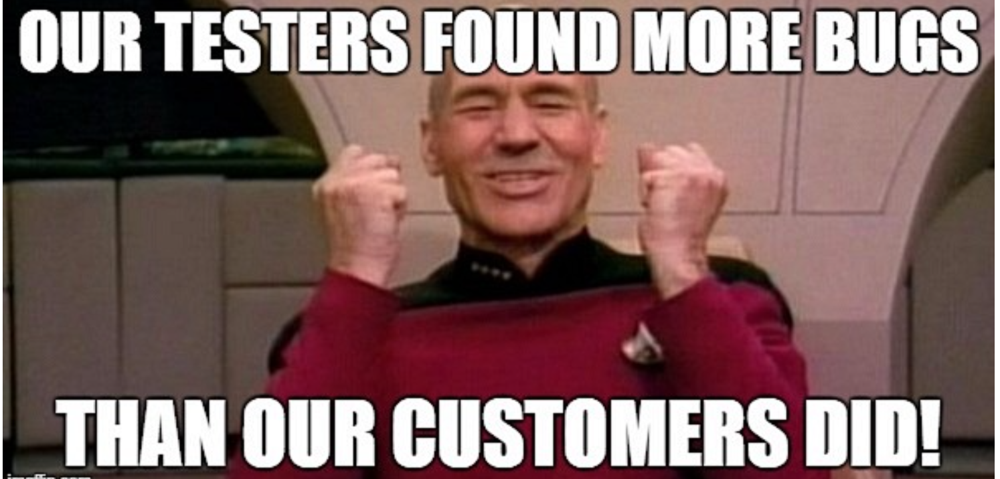
OLX mobile app testing results 🎯 : https://drive.google.com/file/d/1Zs6L9POlxO2goNOSbx1F7-k_so5FCPtA/view?usp=share_link
## <span style="color:darkorange">Subtask 3</span>


<span style="color:limegreen">1. Do czego służy ta aplikacja? Jaki jest cel tej aplikacji?</span>.


*Jest to aplikacja z różnego rodzaju ogłoszeniami. Użytkownik może tam np. sprzedać lubi kupić jakąś rzecz czy usługę, albo też oddać coś za darmo. W moje opinii ogólnym celem aplikacji OLX jest zrezszenie różnych ogłoszeń z całego kraju w tej jednej bazie, jaką jest OLX.*

<span style="color:limegreen">2. Kto ma być użytkownikiem końcowym aplikacji?</span>

*Użytkownikiem końcowym aplikacji jest każdy kto z niej korzysta.*

<span style="color:limegreen">3. Czy według Ciebie aplikacja jest user friendly?</span>

*Wg mnie aplikacjka OLX jest jak najbardziej user-friendly. Można pobrać ją za darmo. Prosty interfejs sparwia, że aplikacja jest łatwa w obsłudze .Od razu po wejściu widoczne są kategorie, które możemy wybrać i przefiltrować tak jak tego potrzebujemy (a więc spersonalizować). Aplikacja została stworzona na białym tle, a relacje pomiędzy kolorami oraz kontrastami poszczególnych elementów przyciągają uwagę użytkownika.*

<span style="color:limegreen">4. Jak byś usprawnił aplikację? Co byś w niej poprawił? Czy masz jakiś pomysł na dodatkową funkcjonalność?</span> 

*Przeglądając aplikację, natrafiłam na ogłoszenie o pracę, które powtarza się chyba we wszystkich województwach i ewidentnie jest oszustwem. W związku z tym wprowadziłabym jakiś komunikat pod tego typu ogłoszeniami, "ostrzegający" o możliwym oszustwie.*

<span style="color:limegreen">5. Jakie dostrzegasz różnice pomiędzy testowaniem aplikacji internetowej, a natywnej?</span>

---
*Aplikację mobilną moge testować w trybie offline, czego nie mogę zrobić przy testowaniu aplikacji internetowej.* 

---

*Przetestowanie aplikacji mobilnej wymagało zainstalowanie jej na telefonie, co nie było potrzebne w przypadku aplikacji internetowej.*

---

*W aplikacji mobilnej odnalazłam więcej funkcjonalności, niż w aplikacji internetowej.*

---

*Testując aplikację internetową na komputerze korzystałam z DevTool'sów, czego nie mogłam zrobić testując aplikację natywną na telefonie (wiem, że "jakoś" to się da, ale jest to dużo bardziej uciążliwe).*

---

*Przy testowaniu aplikacji mobilnej jest brak myszki. Jest to w mojej opinii trudniejsze i trzeba zwracać dużą uwagę na wielkość buttonów oraz ich rozmieszczenie.*
## <span style="color:darkorange">Subtask 4</span>
SwipeTo sprint 🏃‍♀️⌚︎: https://wannai.atlassian.net/jira/software/projects/DIT/boards/2

# <span style="color:yellow">🚀 Task 5 🚀</span>

## <span style="color:darkorange">Subtask 1</span>


## <span style="color:darkorange">Subtask 2</span>

Instalacja Xampp przebiegła pomyślnie :) . 

## <span style="color:darkorange">Subtask 3</span>

*1. Wyświetl tabelę actors w kolejności alfabetycznej sortując po kolumnie surname.*

SELECT * FROM 'actors';

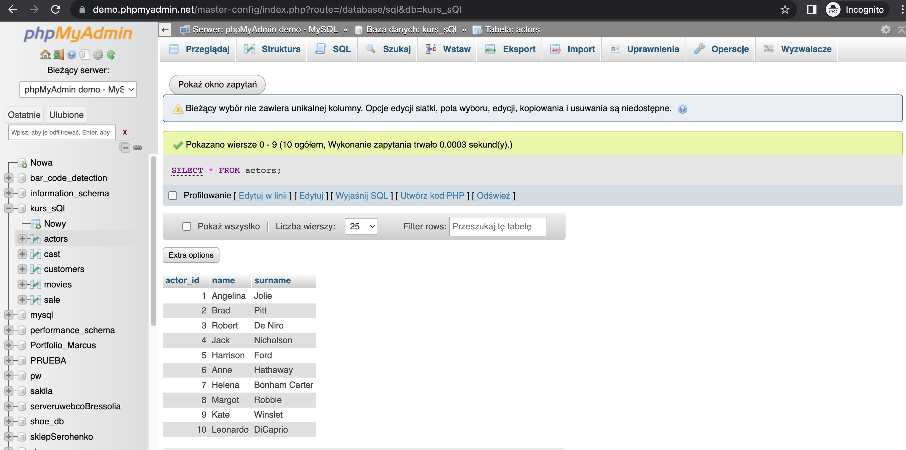

---

*2. Wyświetl film, który powstał w 2019 roku.*

SELECT * FROM 'movies' WHERE year_of_production = '2019';

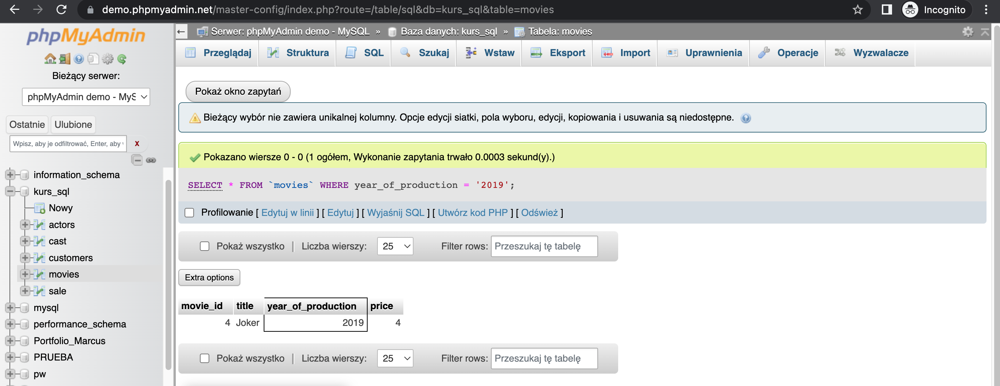

---

*3. Wyświetl wszystkie filmy, które powstały między 1900, a 1999 rokiem.*

SELECT * FROM 'movies' WHERE year_of_production BETWEEN '1900' AND '1999';

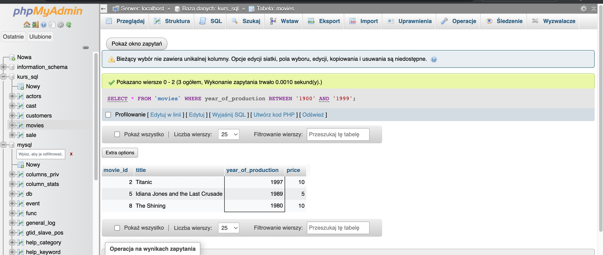

---

*4. Wyświetl JEDYNIE tytuł i cenę filmów, które kosztują poniżej 7$.*

SELECT title, price

FROM 'movies'

WHERE price < 7;

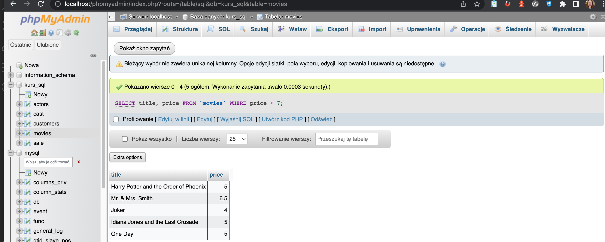

---

*5. Użyj operatora logicznego AND, aby wyświetlić aktorów o actor_id pomiędzy 4-7 (4 i 7 powinny się wyświetlać). NIE UŻYWAJ operatora BETWEEN.*

SELECT * FROM 'actors'

WHERE actor_id < 3 AND actor_id > 8;

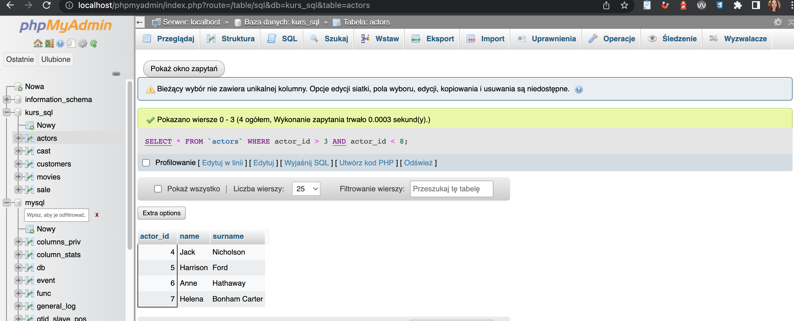

---

*6. Wyświetl klientów o id 2,4,6 wykorzystaj do tego warunek logiczny.*

SELECT * FROM 'customers' 

WHERE customer_id = 2 OR customer_id = 4 OR customer_id = 6;

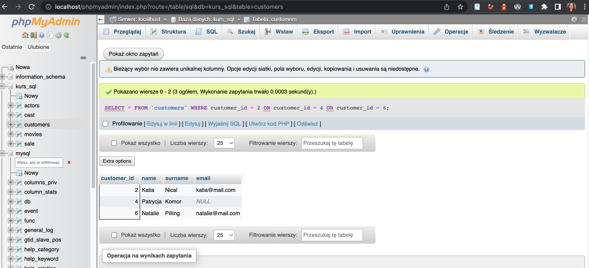

---

*7. Wyświetl klientów o id 1,3,5 wykorzystaj do tego operator IN*

SELECT * FROM 'customers' WHERE customer_id IN (1,3,5);

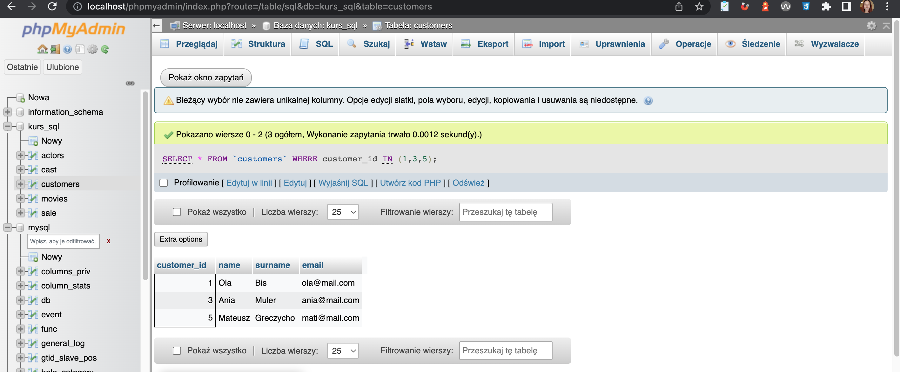

---

*8. Wyświetl dane wszystkich osób z tabeli ‘actors’, których imię zaczyna się od ciągu “An”.*

SELECT * FROM 'actors' WHERE name LIKE 'An%'; 

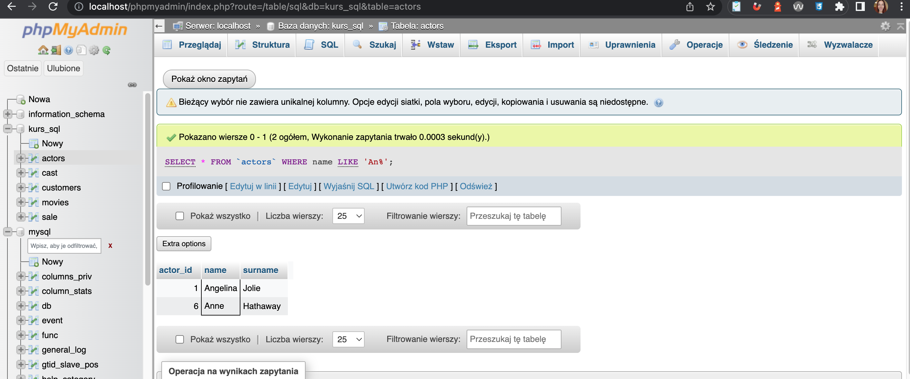

---

*9. Wyświetl dane klienta, który nie ma podanego adresu email.*

SELECT * FROM 'customers' WHERE email IS NULL; 

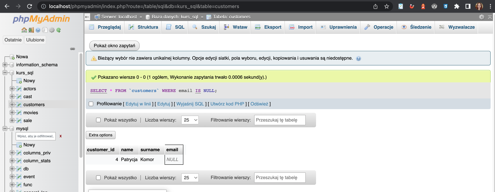

---

*10. Wyświetl wszystkie filmy, których cena wynosi powyżej 9$ oraz ich ID mieści się pomiędzy 2 i 8 movie_id.*

SELECT * FROM 'movies' WHERE price > 9 AND movie_id BETWEEN 2 AND 8;

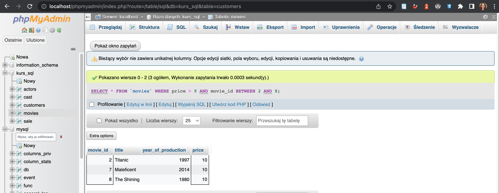


